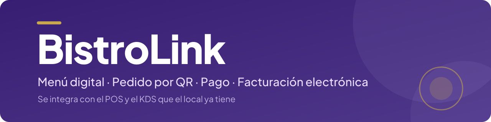

<p align="center">
  
</p>

<p align="center">
  <a href="https://github.com/VED-VirtualExperienceDevelopment/bistrolink/actions/workflows/ci.yml"></a>
  <a href="https://codecov.io/gh/VED-VirtualExperienceDevelopment/bistrolink/branch/develop"></a>
  <a href="https://ved-virtualexperiencedevelopment.github.io/bistrolink/"></a>
</p>

<p align="center">
  
  
  
  
  
  
  
</p>

Middleware que conecta el menú digital, el pedido autogestionado (QR/web), el pago electrónico y la facturación electrónica con el POS y el KDS ya instalados en el local, sin reemplazarlos.

## Stack

| Capa | Tecnología |
|---|---|
| Frontend | Next.js + React |
| Backend | NestJS |
| Tiempo real | Socket.io (WebSocket) |
| Base de datos | PostgreSQL + Prisma (multi-tenant, RLS) |
| Autenticación | Keycloak (OAuth2/OIDC) |
| Testing | Jest (unitarios e integración), Playwright (E2E), k6 y Lighthouse (performance) |
| Gestión de casos de prueba | Kiwi TCMS |
| Hosting | Railway (staging y producción), imágenes en GHCR |

## Monorepo

```
apps/backend/     → API NestJS (Prisma en apps/backend/prisma)
apps/frontend/    → Web Next.js
keycloak/         → Imagen de Keycloak, realm y usuarios de prueba
e2e/              → Tests E2E con Playwright
k6/               → Pruebas de carga
testmgmt/docker/  → Imagen de Kiwi TCMS
infra/backup/     → Servicio de respaldo diario de las bases
scripts/          → Commits, dashboards y utilidades del equipo
docs/             → Runbooks, seguridad y dashboards
```

## Entorno local

Requisitos: **Node.js 22** y **Docker**.

1. Instalar las dependencias (workspaces de npm):
   ```bash
   npm ci
   ```
2. Variables de entorno: copiar `.env.example` a `apps/backend/.env` y completarlo (Docker Compose lee ese mismo archivo). Las `NEXT_PUBLIC_*` del frontend van en `apps/frontend/.env.local` ([detalle](apps/frontend/README.md#desarrollo-local)). Los valores de staging nunca van en un `.env`: se cargan en la sesión de la terminal (ver [`docs/runbooks/migraciones-y-seed.md`](docs/runbooks/migraciones-y-seed.md)).
3. Levantar PostgreSQL y Keycloak:
   ```bash
   docker compose up -d
   ```
   La base local se inicializa con lo necesario para que la API respete el aislamiento entre restaurantes (RLS), y Keycloak importa el realm de desarrollo ([`keycloak/README.md`](keycloak/README.md)).
4. Migraciones y datos de prueba:
   ```bash
   cd apps/backend
   npx prisma migrate deploy
   npx prisma db seed
   ```
   `migrate deploy` aplica las migraciones del repositorio. `migrate dev` se usa solo para crear una migración nueva después de cambiar `schema.prisma`. El seed es idempotente y se puede volver a correr.
5. API y web juntas, desde la raíz:
   ```bash
   npm run dev
   ```
   La API queda en `http://localhost:3001` y la web en `http://localhost:3000`.

## Tests

| Qué | Comando (desde la raíz) | Detalle |
|---|---|---|
| Unitarios (backend y frontend) | `npm test` | Jest; cobertura con `npm run test:cov` |
| E2E | `npm run test:e2e` | Playwright; ver [`e2e/README.md`](e2e/README.md) |
| Carga | — | k6, con el workflow manual `performance.yml` |

Los resultados de los tests automáticos se reportan a Kiwi TCMS desde el pipeline.

## CI/CD

Pipeline en GitHub Actions ([`.github/workflows/ci.yml`](.github/workflows/ci.yml)). Se dispara en push y PR a `develop` y `main`, en tags `v*.*.*` y a mano.

- 🔎 **Detectar cambios**: `dorny/paths-filter`. Los PRs que solo tocan documentación no construyen imágenes.
- 🔍 **Lint**: ESLint y Prettier.
- 🧪 **Tests unitarios (Jest)**: cobertura mínima del 80 %, cobertura a Codecov y resultados a Kiwi TCMS.
- 🔐 **Gitleaks**: secretos en todo el historial.
- 🛡️ **CodeQL** y 📊 **SonarCloud**: análisis estático (SAST).
- 📦 **Dependencias**: Trivy sobre el lockfile (vulnerabilidades críticas y altas de las dependencias de producción) y `dependency-review` en los PRs.
- 🐳 **Build + Escaneo**: imágenes de API, Web y Auth, escaneo con Trivy y publicación en GHCR.
- 🚀 **Deploy staging**: automático en cada push a `develop`. Railway aplica las migraciones de Prisma antes de arrancar la API (*pre-deploy*), y el pipeline hace un smoke test con reintentos.
- 🔦 **Lighthouse**: performance mobile contra staging.
- 🎭 **E2E (Playwright)**: cuatro navegadores contra staging. En `develop` es informativo y no corta el pipeline; en `main` y en los tags de release es bloqueante.

Las ramas `develop` y `main` están protegidas: solo se mergea por PR, con revisión de otro integrante y con los controles de calidad y seguridad en verde.

**Producción:** se despliega con un tag `vX.Y.Z` sobre `main`, con aprobación manual.

### Otros workflows

| Workflow | Qué hace |
|---|---|
| [`publicar-dashboards.yml`](.github/workflows/publicar-dashboards.yml) | Genera los dashboards de avance (Linear) y de bugs (GitHub Issues), los publica en GitHub Pages y manda el correo de estado al cierre de cada sprint |
| [`db-backup-check.yml`](.github/workflows/db-backup-check.yml) | Todos los días: controla que exista el respaldo del día de las bases |
| [`db-backup-restore-test.yml`](.github/workflows/db-backup-restore-test.yml) | Todos los meses: prueba la restauración del último respaldo en un entorno temporal |
| [`ghcr-cleanup.yml`](.github/workflows/ghcr-cleanup.yml) | Todas las semanas: limpia imágenes viejas de GHCR y conserva las de release |
| [`performance.yml`](.github/workflows/performance.yml) | Manual: pruebas de carga con k6 y Lighthouse, con reporte a Kiwi TCMS |
| [`cleanup-test-runs.yml`](.github/workflows/cleanup-test-runs.yml) | Manual: limpia corridas viejas en Kiwi TCMS |

## Ambientes

| Servicio | Staging |
|---|---|
| Web | https://bistrolink-web-staging.up.railway.app |
| Testing (Kiwi TCMS) | https://testmgmt-staging.up.railway.app |
| Dashboards (avance y bugs) | https://ved-virtualexperiencedevelopment.github.io/bistrolink/ |

## Documentación

Índice completo en [`docs/README.md`](docs/README.md).

- Por componente: [`apps/backend`](apps/backend/README.md), [`apps/frontend`](apps/frontend/README.md), [`keycloak`](keycloak/README.md), [`e2e`](e2e/README.md), [`testmgmt`](testmgmt/README.md), [`infra/backup`](infra/backup/README.md).
- Runbooks: [migraciones y seed](docs/runbooks/migraciones-y-seed.md), [respaldo y restauración](docs/runbooks/respaldo-y-restauracion.md).
- Seguridad: [endpoints públicos](docs/security/public-endpoints.md).

## Commits

Los commits siguen Conventional Commits con el ticket de Linear y se hacen con `npm run commit`, que crea la rama desde `develop`. Detalle en [`docs/COMMITS.md`](docs/COMMITS.md).

## Licencia

[MIT](LICENSE)
