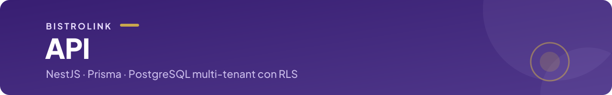

<p align="center">
  
</p>

<p align="center">
  <a href="../../README.md">← BistroLink</a> ·
  
  
  
  
</p>

## API de BistroLink

API en **NestJS** con **Prisma** sobre PostgreSQL. Es **multi-tenant**: cada restaurante ve solo sus datos, y el aislamiento lo garantiza la base con políticas RLS, no solo el código. La autenticación la valida contra Keycloak (tokens OIDC) y el tiempo real (KDS, seguimiento del pedido, mapa de mesas) va por Socket.io.

## Estructura

```
src/
├── menu/             → Menú público del comensal (QR y enlace directo)
├── pedidos/          → Pedidos, estados y eventos en tiempo real para el KDS
├── mesas/            → Mesas, layout del salón y llamado al mozo
├── pagos/            → Pago electrónico
├── restaurantes/     → Restaurantes del tenant
├── usuarios/         → Personal del local (alta, baja y roles)
├── plataforma/       → Alta y gestión de restaurantes (rol de plataforma)
├── auth/             → Validación de tokens y roles
├── auth-comensal/    → Token del comensal sin login
├── keycloak-admin/   → Alta de usuarios en Keycloak desde la API
├── audit-log/        → Registro de auditoría
├── prisma/           → Conexión a la base con el contexto del tenant (RLS)
├── logger/           → Logs estructurados
└── health.controller → /health, /health/ready y /health/version
prisma/               → schema.prisma, migraciones y seed de datos de prueba
scripts/              → Utilidades (aprovisionar un restaurante, generar QR)
test/unitarios/       → Tests unitarios (Jest)
test/integration/     → Tests de integración (*.e2e-spec.ts), incluido el aislamiento entre tenants
```

## Desarrollo local

Requisitos: Node.js 22 y la base y Keycloak corriendo con Docker Compose (ver el [README raíz](../../README.md#entorno-local)).

```bash
npm run start:dev -w apps/backend   # solo la API, con recarga
npm run dev                         # API y web juntas (desde la raíz)
```

La API queda en `http://localhost:3001`. Las variables se leen de `apps/backend/.env` (plantilla en [`.env.example`](../../.env.example)). La API usa dos conexiones distintas a la base: una con permisos para las migraciones y otra restringida para la aplicación, que respeta el RLS. Al arrancar controla que estén las variables obligatorias.

### Base de datos

```bash
cd apps/backend
npx prisma migrate deploy   # aplica las migraciones del repositorio
npx prisma migrate dev      # crea una migración nueva después de cambiar schema.prisma
npx prisma db seed          # datos de prueba (idempotente)
npx prisma studio           # explorar las tablas en el navegador
```

En staging y producción las migraciones las aplica Railway antes de arrancar cada versión de la API. Nunca se corre `migrate dev` ni `migrate reset` contra esas bases ([runbook](../../docs/runbooks/migraciones-y-seed.md)).

## Tests

```bash
npm test -w apps/backend           # unitarios
npm run test:cov -w apps/backend   # con cobertura (mínimo 80 % en el pipeline)
npm run test:e2e -w apps/backend   # integración (requieren la base local)
```

⚠️ `npm run test:e2e` **desde la raíz** corre Playwright, no estos tests. Los de integración se corren con `-w apps/backend`.

## Build

La imagen se construye con el [`Dockerfile`](Dockerfile) de esta carpeta y se publica en GHCR desde el pipeline. Incluye lo necesario para aplicar las migraciones en el arranque.
