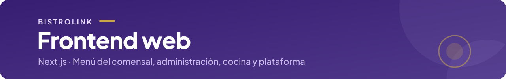

<p align="center">
  
</p>

<p align="center">
  <a href="../../README.md">← BistroLink</a> ·
  
  
  
</p>

## Frontend web

Aplicación web de BistroLink en **Next.js 15** (App Router) con **React 19** y **Tailwind CSS**. Cubre tres públicos:

| Quién              | Qué usa                                                                     |
| ------------------ | --------------------------------------------------------------------------- |
| Comensal           | Menú digital por QR, carrito, pedido y seguimiento en vivo, llamado al mozo |
| Personal del local | Panel de administración (carta, mesas, usuarios) y pantalla de cocina (KDS) |
| Plataforma         | Alta y gestión de restaurantes                                              |

La autenticación es con Keycloak (`keycloak-js`) y el tiempo real con Socket.io.

## Estructura

```
src/app/          → Rutas (App Router): landing, login, admin, kds, plataforma y m/ (menú del comensal)
src/components/   → Componentes por área: admin, kds, menu, plataforma, landing y ui (compartidos)
src/lib/          → Cliente de la API, Keycloak y Socket.io
src/types/        → Tipos compartidos
src/middleware.ts → Redirección a HTTPS (las cabeceras de seguridad están en next.config.mjs)
test/unitarios/   → Tests de Jest
```

## Desarrollo local

Requisitos: Node.js 22 y la API y Keycloak corriendo (ver el [README raíz](../../README.md)).

1. Crear `apps/frontend/.env.local` con las variables `NEXT_PUBLIC_*` de [`.env.example`](../../.env.example), apuntando a la API y al Keycloak locales.
2. Desde la raíz del repo:
   ```bash
   npm run dev                      # API y web juntas
   npm run dev -w apps/frontend     # solo la web
   ```
   La web queda en `http://localhost:3000`.

**Variables `NEXT_PUBLIC_*`:** Next.js las incorpora al código **al compilar**, y quedan visibles en el navegador. Por eso nunca llevan secretos. En staging y producción no se leen de Railway: se pasan al construir la imagen en el pipeline.

## Tests

```bash
npm test -w apps/frontend         # Jest
npm run test:cov -w apps/frontend # con cobertura
```

Los E2E con Playwright están en [`e2e/`](../../e2e/README.md).

## Estilo

- **Tokens de diseño** (colores, tipografía y espaciado) en [`tailwind.config.ts`](tailwind.config.ts). Son los mismos que usan los dashboards del proyecto.
- **Tipografía:** Plus Jakarta Sans **autoalojada** en `src/app/fonts/` (licencia OFL incluida). No depende de Google Fonts al compilar.
- **Título de las pestañas:** `<sección> · BistroLink`. Cada sección exporta su `metadata` desde un layout de servidor.

## Build

La imagen se construye con el [`Dockerfile`](Dockerfile) de esta carpeta, en modo `standalone`, y se publica en GHCR desde el pipeline.
