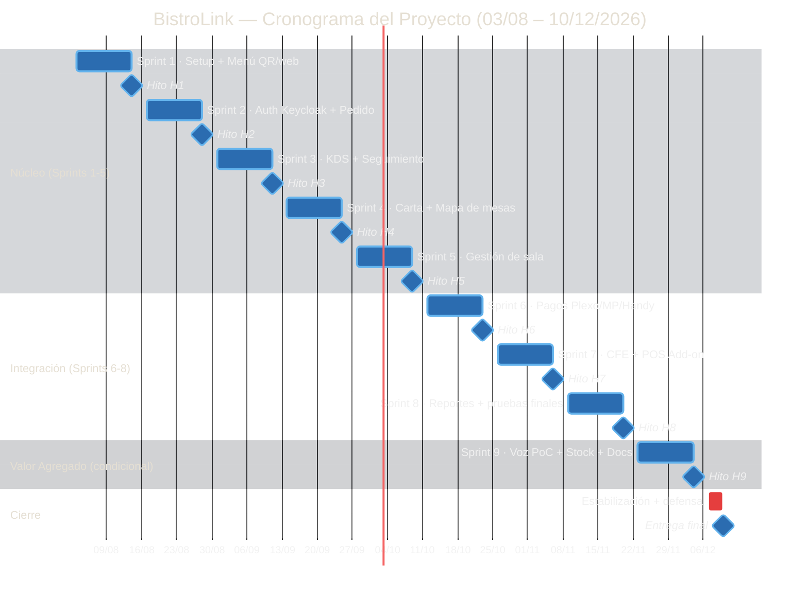
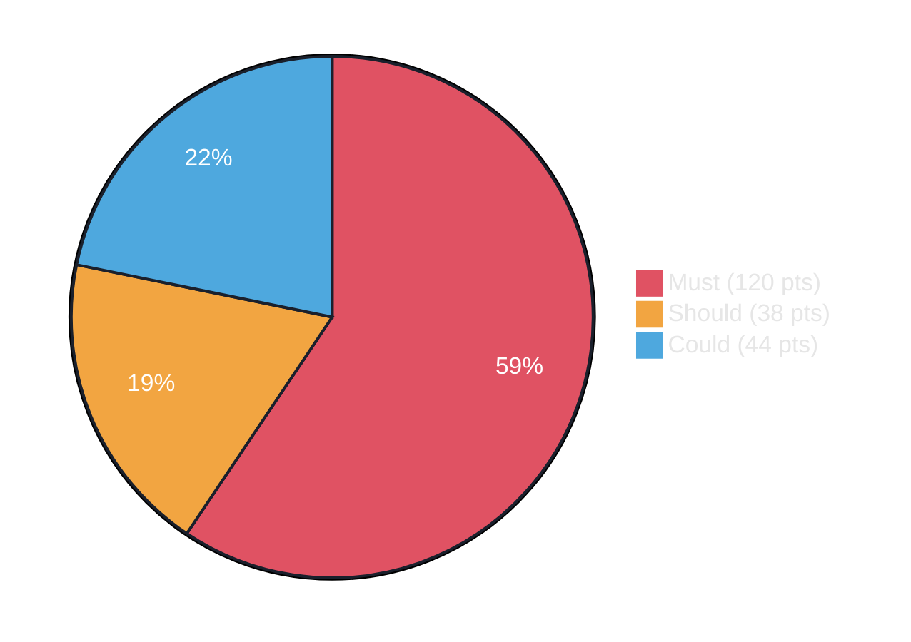

# 🚀 Dashboard de Avance del Proyecto

> **Nota de Control:** Las secciones marcadas con `<!-- AUTO -->` se actualizan automáticamente desde Linear mediante un GitHub Action (`scripts/update-dashboard-from-linear.mjs`). No edites esas tablas a mano — se sobrescriben en la próxima corrida. La distribución de sprints por capa y la línea base de planning se ajustan en `scripts/sprint-config.json`.

---

## 📊 Estado General del Proyecto

### Resumen ejecutivo

<!-- AUTO:resumen-ejecutivo:start -->
| Métrica | Valor |
|---|---|
| Período del proyecto | 03/08/2026 – 10/12/2026 |
| Sprints planificados | 9 Sprints (2 semanas c/u) + ciclo de cierre |
| Historias de Usuario totales (actual) | 135 |
| Story Points totales (actual) | 200 pts |
| **Sprint actual** | **9** |
| **Story Points completados a la fecha** | **39** |
| **% Avance global** | **20%** |

> Última actualización automática: `06/09/2026` — generado desde Linear por GitHub Action.

> ℹ️ El alcance actual (135 HU / 200 pts) difiere de la línea base de planning (26 HU / 202 pts) — se agregaron o quitaron historias después del kickoff.
<!-- AUTO:resumen-ejecutivo:end -->

### Avance por Capa

<!-- AUTO:avance-por-capa:start -->
| Capa | Sprints | HU totales | Story Points | HU completadas | % Avance |
|---|---|---|---|---|---|
| 🟩 Núcleo | 1–5 | 78 | 79 | 46 | 59% |
| 🟦 Integración | 6–8 | 40 | 77 | 0 | 0% |
| 🟪 Valor Agregado (cond.) | 9–9 | 16 | 44 | 0 | 0% |
| **Total** | **1–9** | **134** | **200** | **46** | **34%** |
<!-- AUTO:avance-por-capa:end -->

---

## 📈 Gráficos y Esquemas de Avance

### Cronograma general (Anexo 7 — Diagrama de Gantt)

### Distribución de Story Points por prioridad (MoSCoW)

> ℹ️ Este gráfico refleja la distribución MoSCoW de la línea base de planning original. Si el equipo quiere que también se recalcule con Linear (requiere labels `Must` / `Should` / `Could` en los issues), se puede automatizar en una siguiente iteración.

### Story Points planificados vs. completados por Sprint

<!-- AUTO:sp-por-sprint-chart:start -->
%%{init: {'theme':'base', 'themeVariables': {
  'xyChart': {
    'backgroundColor': '#1a202c',
    'titleColor': '#ffffff',
    'xAxisLabelColor': '#e6e6e6',
    'xAxisTitleColor': '#e6e6e6',
    'xAxisTickColor': '#a0aec0',
    'xAxisLineColor': '#a0aec0',
    'yAxisLabelColor': '#e6e6e6',
    'yAxisTitleColor': '#e6e6e6',
    'yAxisTickColor': '#a0aec0',
    'yAxisLineColor': '#a0aec0',
    'plotColorPalette': '#e05263, #4ea8de'
  }
}}}%%
xychart-beta
    title "Story Points planificados vs. completados por Sprint"
    x-axis [Sprint1, Sprint2, Sprint3, Sprint4, Sprint5, Sprint6, Sprint7, Sprint8, "Sprint9(cond)"]
    y-axis "Story Points" 0 --> 50
    bar "Planificado" [18, 24, 5, 16, 13, 37, 37, 8, 44]
    bar "Completado" [5, 13, 21, 0, 0, 0, 0, 0, 0]
<!-- AUTO:sp-por-sprint-chart:end -->