# 🐛 Dashboard de Bugs (GitHub Issues)

> **Nota de Control:** Las secciones marcadas con `<!-- AUTO -->` se actualizan automáticamente desde GitHub Issues mediante un GitHub Action (`scripts/update-github-bugs-dashboard.mjs`). No las edites a mano — se sobrescriben en la próxima corrida. Para cambiar qué se considera "bug" (label vs. Issue Type) o cuántas semanas mostrar en la tendencia, editá `scripts/github-bugs-config.json`.

---

## 📊 Resumen

<!-- AUTO:resumen-bugs:start -->
| Métrica | Valor |
|---|---|
| Total de bugs registrados | ✏️ *(se completa en la primera corrida)* |
| **Abiertos** | ✏️ |
| **Cerrados** | ✏️ |
| % Resueltos | ✏️ |
| Tiempo promedio de resolución | ✏️ |
| Tiempo mediana de resolución | ✏️ |
<!-- AUTO:resumen-bugs:end -->

---

## 📈 Tendencia semanal (abiertos vs. cerrados)

```mermaid
xychart-beta
    title "Bugs abiertos vs. cerrados por semana"
    x-axis ["—"]
    y-axis "Cantidad de bugs" 0 --> 5
    bar "Abiertos" [0]
    bar "Cerrados" [0]
```

<!-- AUTO:tendencia-bugs-chart:start -->

<!-- AUTO:tendencia-bugs-chart:end -->

> Si tu versión de GitHub no renderiza `xychart-beta`, usa la tabla equivalente:

<!-- AUTO:tendencia-bugs-tabla:start -->
| Semana (inicio) | Abiertos | Cerrados |
|---|:---:|:---:|
| ✏️ | ✏️ | ✏️ |
<!-- AUTO:tendencia-bugs-tabla:end -->