# 🐛 Dashboard de Bugs (GitHub Issues)

> **Nota de Control:** Las secciones marcadas con `<!-- AUTO -->` se actualizan automáticamente desde GitHub Issues mediante un GitHub Action (`scripts/update-github-bugs-dashboard.mjs`). No las edites a mano — se sobrescriben en la próxima corrida. Para cambiar qué se considera "bug" (label vs. Issue Type) o cuántas semanas mostrar en la tendencia, editá `scripts/github-bugs-config.json`.

---

## 📊 Resumen

<!-- AUTO:resumen-bugs:start -->

| Métrica                       | Valor    |
| ----------------------------- | -------- |
| Total de bugs registrados     | 8        |
| **Abiertos**                  | **0**    |
| **Cerrados**                  | **8**    |
| % Resueltos                   | 100%     |
| Tiempo promedio de resolución | 0.2 días |
| Tiempo mediana de resolución  | 0.1 días |

> Última actualización automática: `19/09/2026` — generado desde GitHub Issues por GitHub Action.

<!-- AUTO:resumen-bugs:end -->

---

## 📈 Tendencia semanal (abiertos vs. cerrados)

```mermaid
%%{init: {'theme':'base', 'themeVariables': {
  'background': '#1a202c',
  'xyChart': {
    'backgroundColor': '#1a202c',
    'titleColor': '#ffffff',
    'xAxisLabelColor': '#e6e6e6',
    'xAxisTitleColor': '#e6e6e6',
    'xAxisTickColor': '#a0aec0',
    'xAxisLineColor': '#a0aec0',
    'yAxisLabelColor': '#e6e6e6',
    'yAxisTitleColor': '#e6e6e6',
    'yAxisTickColor': '#a0aec0',
    'yAxisLineColor': '#a0aec0',
    'plotColorPalette': '#e05263, #4ea8de'
  }
}}}%%
xychart-beta
    title "Bugs abiertos vs. cerrados por semana"
    x-axis ["27/7", "3/8", "10/8", "17/8", "24/8", "31/8", "7/9", "14/9"]
    y-axis "Cantidad de bugs" 0 --> 5
    bar "Abiertos" [0, 0, 0, 0, 0, 4, 1, 3]
    bar "Cerrados" [0, 0, 0, 0, 0, 4, 1, 3]
```

<!-- AUTO:tendencia-bugs-chart:start -->

<!-- AUTO:tendencia-bugs-chart:end -->

> Si tu versión de GitHub no renderiza `xychart-beta`, usa la tabla equivalente:

<!-- AUTO:tendencia-bugs-tabla:start -->

| Semana (inicio) | Abiertos | Cerrados |
| --------------- | :------: | :------: |
| 27/7            |    0     |    0     |
| 3/8             |    0     |    0     |
| 10/8            |    0     |    0     |
| 17/8            |    0     |    0     |
| 24/8            |    0     |    0     |
| 31/8            |    4     |    4     |
| 7/9             |    1     |    1     |
| 14/9            |    3     |    3     |

<!-- AUTO:tendencia-bugs-tabla:end -->
