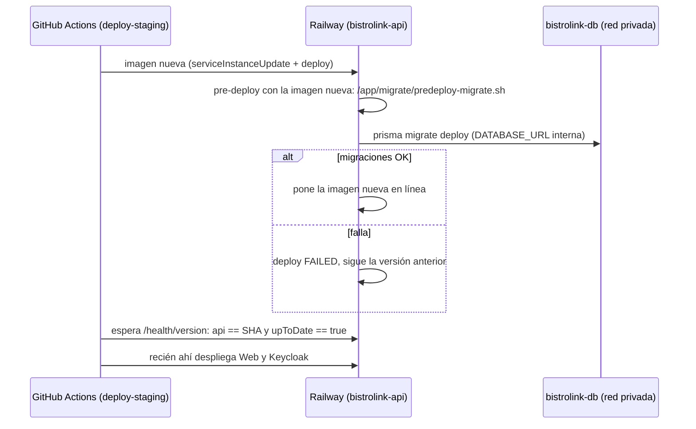

# Runbook: migraciones de la base y seed en Railway

> **Ticket:** BL-231 · **Relacionado:** BL-220 (release a producción), BL-232 (checklist de producción), BL-137 (base sin migraciones en staging) · **Documentación del proyecto:** Anexo 12, hallazgos A7, D2 y D8.
> **Última revisión:** 08/10/2026 (§5: acceso a la base por túnel SSH con `railway connect`, sin volver a abrir el TCP Proxy).

## 1. Cómo se aplican las migraciones

`bistrolink-db` **no tiene acceso público**: no hay TCP Proxy, y GitHub no tiene la URL de la base. Las migraciones de Prisma las aplica Railway con el **pre-deploy command** de `bistrolink-api`.



| Pieza                                                               | Dónde                                                                                    |
| ------------------------------------------------------------------- | ---------------------------------------------------------------------------------------- |
| CLI de Prisma (versión del lockfile) con los motores ya descargados | `apps/backend/Dockerfile`, stage `migrate` → `/app/migrate` en la imagen                 |
| Script del pre-deploy                                               | `apps/backend/docker/predeploy-migrate.sh` → `/app/migrate/predeploy-migrate.sh`         |
| Schema y migraciones que se aplican                                 | `apps/backend/prisma/` de la misma imagen                                                |
| Control en el pipeline                                              | Paso «Esperar la API nueva (pre-deploy con migraciones)» de `deploy-staging` en `ci.yml` |

**Rollback:** al volver a una imagen anterior, Railway corre de nuevo el pre-deploy con las migraciones de esa imagen. `migrate deploy` solo aplica las pendientes, así que no toca la base (patrón expand/contract). Solo se puede volver a imágenes **posteriores a BL-231**: las anteriores no tienen el script y Railway no las pondría en línea. El job de rollback lo verifica antes de empezar.

## 2. Configuración en Railway (una vez por entorno)

En `bistrolink-api` → **Settings → Deploy**:

| Campo              | Valor                                                                                   |
| ------------------ | --------------------------------------------------------------------------------------- |
| Pre-deploy Command | `/app/migrate/predeploy-migrate.sh`                                                     |
| Pre-deploy Timeout | `300` segundos (si una migración se cuelga, el deploy falla en vez de quedar esperando) |

El script necesita `DATABASE_URL` con la URL **interna** (`${{bistrolink-db.DATABASE_URL}}`, hallazgo A8). Producción se configura igual (checklist BL-232).

## 3. Puesta en marcha en staging (BL-231)

El orden importa: si el pre-deploy se configura antes de que exista una imagen con `/app/migrate`, el deploy falla.

1. **Antes de mergear:** abrir `https://bistrolink-api-staging.up.railway.app/health/version` y confirmar que responde `"upToDate": true`. El pipeline nuevo lo exige en cada deploy.
2. **Mergear el PR de BL-231.** El pipeline construye la imagen nueva (el build ya comprueba que los motores de Prisma estén en la imagen) y la despliega. Este primer deploy todavía no corre migraciones, porque el pre-deploy no está configurado. No hace falta: el PR no trae migraciones nuevas.
3. **Configurar el pre-deploy** en `bistrolink-api` (sección 2) y hacer **Redeploy** del deploy activo.
4. **Verificar:** en el deploy nuevo → logs del pre-deploy deben aparecer `[predeploy] aplicando migraciones pendientes...` y `No pending migrations to apply.`; después `/health/version` con `"upToDate": true`.
5. **Borrar el TCP Proxy** de `bistrolink-db`: Settings → Networking → Public Networking → TCP Proxy → borrar. Confirmar que desaparece la variable `DATABASE_PUBLIC_URL` y que ningún servicio la referenciaba.
6. **Borrar los secrets `STAGING_DATABASE_URL` y `PROD_DATABASE_URL`** en GitHub → Settings → Secrets and variables → Actions. Ningún workflow los usa desde BL-231, y son la URL de la base con un usuario superusuario.
7. **Comprobar el pipeline completo** con el siguiente push a `develop`: el paso «Esperar la API nueva» tiene que pasar en verde.
8. **Registrar** en el Anexo 12 (§9): pre-deploy configurado, TCP Proxy borrado, secret eliminado; cerrar A7, D2 y D8.

**Prueba del rollback:** con el primer PR posterior que traiga una migración nueva, hacer un rollback de prueba al SHA anterior (job de rollback, `rollback_environment: staging`). Esperado: el pre-deploy termina con `No pending migrations to apply.`, la API queda en el SHA viejo y `/health/version` responde `"upToDate": false` (la base tiene una migración que la imagen vieja no conoce). Después volver a desplegar el SHA nuevo. Registrar el resultado en el Anexo 12 §9.

## 4. Si falla el pre-deploy

Railway deja en línea la versión anterior y el paso «Esperar la API nueva» falla a los 10 minutos con el aviso. Web y Keycloak no se despliegan.

1. Railway → `bistrolink-api` → **Deployments** → el deploy del SHA → **logs del pre-deploy**.
2. Según el error:
   - **`Error: P1001` (no llega a la base):** revisar que `bistrolink-db` esté en línea y que `DATABASE_URL` de `bistrolink-api` sea la referencia interna.
   - **Error de SQL en una migración:** la migración quedó marcada como fallida en `_prisma_migrations` y Prisma no aplica nada más hasta resolverla (`P3009`). Corregir **hacia adelante**: nunca editar una migración ya aplicada en otra base. Para marcarla como revertida o aplicada hace falta `prisma migrate resolve` contra la base, con el túnel de la sección 5.
3. Corregir, mergear y dejar que el pipeline despliegue de nuevo.

## 5. Acceso a la base desde una PC del equipo (seed y casos excepcionales)

Sirve para el seed, `prisma migrate resolve` (sección 4) o una consulta con DBeaver, pgAdmin o `psql`. El seed (`apps/backend/prisma/seed.ts`) carga los tenants de testing A y B (BL-197). Es idempotente (upsert por id fijo), así que se corre **cada vez que un PR cambia el seed**, en el mismo PR o apenas se mergea: si un E2E usa un dato nuevo del seed y staging no lo tiene, falla sin una causa visible (pasó con `mozo-test` y con la mesa …334). En producción **nunca** se corre.

La base no tiene acceso público y **no se vuelve a habilitar el TCP Proxy** (hallazgos D2 y D8). Se entra con un **túnel SSH de la CLI de Railway**: autenticado con el usuario de Railway de cada integrante, abierto solo en la PC que lo pide y cerrado con `Ctrl+C`. La base nunca queda expuesta a internet.

**Requisitos (una vez por PC):**

- CLI de Railway actualizada (`railway --version`; para actualizar, `railway upgrade` o reinstalar con `npm i -g @railway/cli`).
- Sesión iniciada (`railway login`) y el repositorio vinculado al proyecto (`railway link`).
- Si la CLI lo pide, registrar una clave SSH en la cuenta de Railway (muestra el enlace para hacerlo).

**Pasos:**

1. **Terminal 1, abrir el túnel** (queda abierto hasta `Ctrl+C`):

   ```bash
   railway connect bistrolink-db --environment staging --tunnel-only --port 15432
   ```

   La CLI imprime host (`127.0.0.1`), puerto, usuario, contraseña, base y la URL completa de conexión. **La salida incluye la contraseña:** no compartir pantalla ni grabar mientras se ve, y no copiarla a archivos, chats ni documentos.

2. **Terminal 2, correr el seed** desde `apps/backend`, con la URL que imprimió el túnel:

   ```bash
   # Linux / macOS
   DATABASE_URL='<URL que imprimió el túnel>' npx prisma db seed
   ```

   ```powershell
   # Windows (PowerShell)
   $env:DATABASE_URL='<URL que imprimió el túnel>'; npx prisma db seed; Remove-Item Env:DATABASE_URL
   ```

   Para DBeaver o pgAdmin: host `127.0.0.1`, puerto `15432` y el resto de los datos que imprimió el túnel.

3. **Verificar** con la API de staging (mismos IDs que `e2e/support/ids.ts`):

   ```bash
   curl https://bistrolink-api-staging.up.railway.app/menu/tenant/11111111-1111-1111-1111-111111111111/restaurante/22222222-2222-2222-2222-222222222222
   ```

4. **Cerrar el túnel** con `Ctrl+C` en la terminal 1.
5. **Registrar** en el Anexo 12 §9: fecha, quién, entorno, motivo y qué se ejecutó.

**Si el túnel falla:**

- **`Connection URL should point to the Railway TCP proxy`** (reportado por otros usuarios en Windows): actualizar la CLI y reintentar. Si sigue, abrir el túnel a mano: `railway ssh config --service bistrolink-db --alias bistrolink-db-staging` y después `ssh -L 15432:127.0.0.1:5432 bistrolink-db-staging` (sin `-N`). Conectarse a `127.0.0.1:15432` con el usuario y la contraseña de la variable `DATABASE_URL` de `bistrolink-db`.
- **Aun así no hay forma de entrar:** no habilitar el TCP Proxy por cuenta propia. Reabre la base a internet (D2) y se decide en el equipo; si se acuerda, se borra apenas termina la tarea y se registra en el Anexo 12 §9 con la hora de apertura y de cierre.

**Nunca** correr `prisma migrate reset` ni `prisma migrate dev` contra staging o producción: borran o recrean la base. Las migraciones solo llegan por el pre-deploy.

## 6. Retiro del tenant «Ejemplo» (BL-197, una sola vez por base)

El tenant «Ejemplo» (`554915d0-…`) se fusionó en el tenant de testing A («Restaurante Testing A», `11111111-…`). Cada base y cada Keycloak anteriores a BL-197 (staging y las locales) se migran **una vez**, en este orden. Producción nunca lo tuvo.

1. **Keycloak** (consola, realm `bistrolink` → _Users_): en `admin-test` y en `cocina-test`, cambiar el campo `tenant_id` a `11111111-1111-1111-1111-111111111111` y guardar. Como `tenant_id` está declarado en el user profile del realm (BL-263), el campo aparece en la pestaña _Details_; en un realm sin ese perfil, en _Attributes_. El import de `test-users.json` no lo hace: no toca usuarios existentes.
2. **Seed** (sección 5 en staging; `npx prisma db seed` desde `apps/backend` en local). Renombra A y B, mueve la fila de `admin-test` al tenant A y crea lo que falta (mesa virtual, categoría «Bebidas», fila de `admin-b-test`).
3. **Retiro de Ejemplo:** `apps/backend/scripts/retirar-tenant-ejemplo.sql`. Es un único bloque `DO`: corre en una sola transacción, se corta sin borrar nada si `admin-test` sigue en Ejemplo (falta el paso 2) y se puede repetir.
   - **Staging:** antes, listar los usuarios que se van a borrar desde la pestaña _Query_ de `bistrolink-db` en Railway:
     ```sql
     SELECT username, keycloak_id, rol, activo FROM usuario WHERE tenant_id = '554915d0-f7ed-4053-b841-56479df29fd9' ORDER BY username;
     ```
     Después pegar el contenido del script en la misma pestaña y ejecutarlo.
   - **Local (PowerShell, desde la raíz del repo):**
     ```powershell
     Get-Content apps/backend/scripts/retirar-tenant-ejemplo.sql | docker compose exec -T bistrolink-db psql -U bistrolink -d bistrolink_dev
     ```
     Los avisos (`NOTICE`) listan los usuarios que se borraron.
4. **Keycloak:** borrar los usuarios listados en el paso 3 (eran de prueba manual del tenant Ejemplo). No borrar `admin-test` ni `cocina-test`, que ya pasaron a A.
5. **Verificar:** en `/plataforma` aparecen solo «Restaurante Testing A SRL» y «Restaurante Testing B SRL» (más los tenants creados por HU-027), y el login de `admin-test` muestra los datos del tenant A.
6. **Registrar** en el Anexo 12 §9 (staging).# Runbook: migraciones de la base y seed en Railway

> **Ticket:** BL-231 · **Relacionado:** BL-220 (release a producción), BL-232 (checklist de producción), BL-137 (base sin migraciones en staging) · **Documentación del proyecto:** Anexo 12, hallazgos A7, D2 y D8.
> **Última revisión:** 08/10/2026 (§5: acceso a la base por túnel SSH con `railway connect`, sin volver a abrir el TCP Proxy).

## 1. Cómo se aplican las migraciones

`bistrolink-db` **no tiene acceso público**: no hay TCP Proxy, y GitHub no tiene la URL de la base. Las migraciones de Prisma las aplica Railway con el **pre-deploy command** de `bistrolink-api`.


| Pieza                                                               | Dónde                                                                                    |
| ------------------------------------------------------------------- | ---------------------------------------------------------------------------------------- |
| CLI de Prisma (versión del lockfile) con los motores ya descargados | `apps/backend/Dockerfile`, stage `migrate` → `/app/migrate` en la imagen                 |
| Script del pre-deploy                                               | `apps/backend/docker/predeploy-migrate.sh` → `/app/migrate/predeploy-migrate.sh`         |
| Schema y migraciones que se aplican                                 | `apps/backend/prisma/` de la misma imagen                                                |
| Control en el pipeline                                              | Paso «Esperar la API nueva (pre-deploy con migraciones)» de `deploy-staging` en `ci.yml` |

**Rollback:** al volver a una imagen anterior, Railway corre de nuevo el pre-deploy con las migraciones de esa imagen. `migrate deploy` solo aplica las pendientes, así que no toca la base (patrón expand/contract). Solo se puede volver a imágenes **posteriores a BL-231**: las anteriores no tienen el script y Railway no las pondría en línea. El job de rollback lo verifica antes de empezar.

## 2. Configuración en Railway (una vez por entorno)

En `bistrolink-api` → **Settings → Deploy**:

| Campo              | Valor                                                                                   |
| ------------------ | --------------------------------------------------------------------------------------- |
| Pre-deploy Command | `/app/migrate/predeploy-migrate.sh`                                                     |
| Pre-deploy Timeout | `300` segundos (si una migración se cuelga, el deploy falla en vez de quedar esperando) |

El script necesita `DATABASE_URL` con la URL **interna** (`${{bistrolink-db.DATABASE_URL}}`, hallazgo A8). Producción se configura igual (checklist BL-232).

## 3. Puesta en marcha en staging (BL-231)

El orden importa: si el pre-deploy se configura antes de que exista una imagen con `/app/migrate`, el deploy falla.

1. **Antes de mergear:** abrir `https://bistrolink-api-staging.up.railway.app/health/version` y confirmar que responde `"upToDate": true`. El pipeline nuevo lo exige en cada deploy.
2. **Mergear el PR de BL-231.** El pipeline construye la imagen nueva (el build ya comprueba que los motores de Prisma estén en la imagen) y la despliega. Este primer deploy todavía no corre migraciones, porque el pre-deploy no está configurado. No hace falta: el PR no trae migraciones nuevas.
3. **Configurar el pre-deploy** en `bistrolink-api` (sección 2) y hacer **Redeploy** del deploy activo.
4. **Verificar:** en el deploy nuevo → logs del pre-deploy deben aparecer `[predeploy] aplicando migraciones pendientes...` y `No pending migrations to apply.`; después `/health/version` con `"upToDate": true`.
5. **Borrar el TCP Proxy** de `bistrolink-db`: Settings → Networking → Public Networking → TCP Proxy → borrar. Confirmar que desaparece la variable `DATABASE_PUBLIC_URL` y que ningún servicio la referenciaba.
6. **Borrar los secrets `STAGING_DATABASE_URL` y `PROD_DATABASE_URL`** en GitHub → Settings → Secrets and variables → Actions. Ningún workflow los usa desde BL-231, y son la URL de la base con un usuario superusuario.
7. **Comprobar el pipeline completo** con el siguiente push a `develop`: el paso «Esperar la API nueva» tiene que pasar en verde.
8. **Registrar** en el Anexo 12 (§9): pre-deploy configurado, TCP Proxy borrado, secret eliminado; cerrar A7, D2 y D8.

**Prueba del rollback:** con el primer PR posterior que traiga una migración nueva, hacer un rollback de prueba al SHA anterior (job de rollback, `rollback_environment: staging`). Esperado: el pre-deploy termina con `No pending migrations to apply.`, la API queda en el SHA viejo y `/health/version` responde `"upToDate": false` (la base tiene una migración que la imagen vieja no conoce). Después volver a desplegar el SHA nuevo. Registrar el resultado en el Anexo 12 §9.

## 4. Si falla el pre-deploy

Railway deja en línea la versión anterior y el paso «Esperar la API nueva» falla a los 10 minutos con el aviso. Web y Keycloak no se despliegan.

1. Railway → `bistrolink-api` → **Deployments** → el deploy del SHA → **logs del pre-deploy**.
2. Según el error:
   - **`Error: P1001` (no llega a la base):** revisar que `bistrolink-db` esté en línea y que `DATABASE_URL` de `bistrolink-api` sea la referencia interna.
   - **Error de SQL en una migración:** la migración quedó marcada como fallida en `_prisma_migrations` y Prisma no aplica nada más hasta resolverla (`P3009`). Corregir **hacia adelante**: nunca editar una migración ya aplicada en otra base. Para marcarla como revertida o aplicada hace falta `prisma migrate resolve` contra la base, con el túnel de la sección 5.
3. Corregir, mergear y dejar que el pipeline despliegue de nuevo.

## 5. Acceso a la base desde una PC del equipo (seed y casos excepcionales)

Sirve para el seed, `prisma migrate resolve` (sección 4) o una consulta con DBeaver, pgAdmin o `psql`. El seed (`apps/backend/prisma/seed.ts`) carga los tenants de testing A y B (BL-197). Es idempotente (upsert por id fijo), así que se corre **cada vez que un PR cambia el seed**, en el mismo PR o apenas se mergea: si un E2E usa un dato nuevo del seed y staging no lo tiene, falla sin una causa visible (pasó con `mozo-test` y con la mesa …334). En producción **nunca** se corre.

La base no tiene acceso público y **no se vuelve a habilitar el TCP Proxy** (hallazgos D2 y D8). Se entra con un **túnel SSH de la CLI de Railway**: autenticado con el usuario de Railway de cada integrante, abierto solo en la PC que lo pide y cerrado con `Ctrl+C`. La base nunca queda expuesta a internet.

**Requisitos (una vez por PC):**

- CLI de Railway actualizada (`railway --version`; para actualizar, `railway upgrade` o reinstalar con `npm i -g @railway/cli`).
- Sesión iniciada (`railway login`) y el repositorio vinculado al proyecto (`railway link`).
- Si la CLI lo pide, registrar una clave SSH en la cuenta de Railway (muestra el enlace para hacerlo).

**Pasos:**

1. **Terminal 1, abrir el túnel** (queda abierto hasta `Ctrl+C`):

   ```bash
   railway connect bistrolink-db --environment staging --tunnel-only --port 15432
   ```

   La CLI imprime host (`127.0.0.1`), puerto, usuario, contraseña, base y la URL completa de conexión. **La salida incluye la contraseña:** no compartir pantalla ni grabar mientras se ve, y no copiarla a archivos, chats ni documentos.

2. **Terminal 2, correr el seed** desde `apps/backend`, con la URL que imprimió el túnel:

   ```bash
   # Linux / macOS
   DATABASE_URL='<URL que imprimió el túnel>' npx prisma db seed
   ```

   ```powershell
   # Windows (PowerShell)
   $env:DATABASE_URL='<URL que imprimió el túnel>'; npx prisma db seed; Remove-Item Env:DATABASE_URL
   ```

   Para DBeaver o pgAdmin: host `127.0.0.1`, puerto `15432` y el resto de los datos que imprimió el túnel.

3. **Verificar** con la API de staging (mismos IDs que `e2e/support/ids.ts`):

   ```bash
   curl https://bistrolink-api-staging.up.railway.app/menu/tenant/11111111-1111-1111-1111-111111111111/restaurante/22222222-2222-2222-2222-222222222222
   ```

4. **Cerrar el túnel** con `Ctrl+C` en la terminal 1.
5. **Registrar** en el Anexo 12 §9: fecha, quién, entorno, motivo y qué se ejecutó.

**Si el túnel falla:**

- **`Connection URL should point to the Railway TCP proxy`** (reportado por otros usuarios en Windows): actualizar la CLI y reintentar. Si sigue, abrir el túnel a mano: `railway ssh config --service bistrolink-db --alias bistrolink-db-staging` y después `ssh -L 15432:127.0.0.1:5432 bistrolink-db-staging` (sin `-N`). Conectarse a `127.0.0.1:15432` con el usuario y la contraseña de la variable `DATABASE_URL` de `bistrolink-db`.
- **Aun así no hay forma de entrar:** no habilitar el TCP Proxy por cuenta propia. Reabre la base a internet (D2) y se decide en el equipo; si se acuerda, se borra apenas termina la tarea y se registra en el Anexo 12 §9 con la hora de apertura y de cierre.

**Nunca** correr `prisma migrate reset` ni `prisma migrate dev` contra staging o producción: borran o recrean la base. Las migraciones solo llegan por el pre-deploy.

## 6. Retiro del tenant «Ejemplo» (BL-197, una sola vez por base)

El tenant «Ejemplo» (`554915d0-…`) se fusionó en el tenant de testing A («Restaurante Testing A», `11111111-…`). Cada base y cada Keycloak anteriores a BL-197 (staging y las locales) se migran **una vez**, en este orden. Producción nunca lo tuvo.

1. **Keycloak** (consola, realm `bistrolink` → _Users_): en `admin-test` y en `cocina-test`, cambiar el campo `tenant_id` a `11111111-1111-1111-1111-111111111111` y guardar. Como `tenant_id` está declarado en el user profile del realm (BL-263), el campo aparece en la pestaña _Details_; en un realm sin ese perfil, en _Attributes_. El import de `test-users.json` no lo hace: no toca usuarios existentes.
2. **Seed** (sección 5 en staging; `npx prisma db seed` desde `apps/backend` en local). Renombra A y B, mueve la fila de `admin-test` al tenant A y crea lo que falta (mesa virtual, categoría «Bebidas», fila de `admin-b-test`).
3. **Retiro de Ejemplo:** `apps/backend/scripts/retirar-tenant-ejemplo.sql`. Es un único bloque `DO`: corre en una sola transacción, se corta sin borrar nada si `admin-test` sigue en Ejemplo (falta el paso 2) y se puede repetir.
   - **Staging:** antes, listar los usuarios que se van a borrar desde la pestaña _Query_ de `bistrolink-db` en Railway:
     ```sql
     SELECT username, keycloak_id, rol, activo FROM usuario WHERE tenant_id = '554915d0-f7ed-4053-b841-56479df29fd9' ORDER BY username;
     ```
     Después pegar el contenido del script en la misma pestaña y ejecutarlo.
   - **Local (PowerShell, desde la raíz del repo):**
     ```powershell
     Get-Content apps/backend/scripts/retirar-tenant-ejemplo.sql | docker compose exec -T bistrolink-db psql -U bistrolink -d bistrolink_dev
     ```
     Los avisos (`NOTICE`) listan los usuarios que se borraron.
4. **Keycloak:** borrar los usuarios listados en el paso 3 (eran de prueba manual del tenant Ejemplo). No borrar `admin-test` ni `cocina-test`, que ya pasaron a A.
5. **Verificar:** en `/plataforma` aparecen solo «Restaurante Testing A SRL» y «Restaurante Testing B SRL» (más los tenants creados por HU-027), y el login de `admin-test` muestra los datos del tenant A.
6. **Registrar** en el Anexo 12 §9 (staging).
