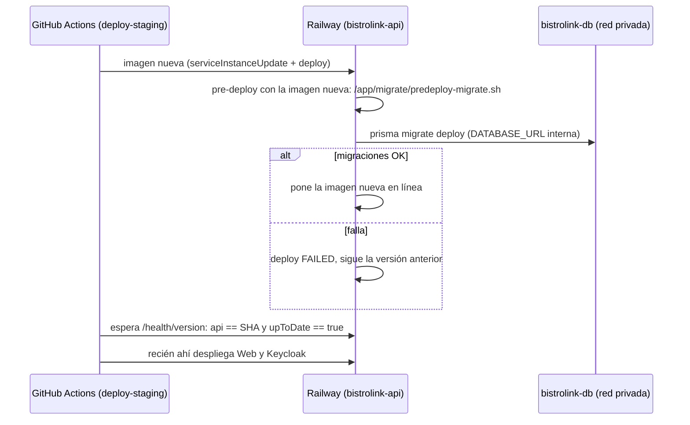

# Runbook: migraciones de la base y seed en Railway

> **Ticket:** BL-231 · **Relacionado:** BL-220 (release a producción), BL-232 (checklist de producción), BL-137 (base sin migraciones en staging) · **Documentación del proyecto:** Anexo 12, hallazgos A7, D2 y D8.
> **Última revisión:** 07/10/2026.

## 1. Cómo se aplican las migraciones

`bistrolink-db` **no tiene acceso público**: no hay TCP Proxy, y GitHub no tiene la URL de la base. Las migraciones de Prisma las aplica Railway con el **pre-deploy command** de `bistrolink-api`.



| Pieza | Dónde |
| --- | --- |
| CLI de Prisma (versión del lockfile) con los motores ya descargados | `apps/backend/Dockerfile`, stage `migrate` → `/app/migrate` en la imagen |
| Script del pre-deploy | `apps/backend/docker/predeploy-migrate.sh` → `/app/migrate/predeploy-migrate.sh` |
| Schema y migraciones que se aplican | `apps/backend/prisma/` de la misma imagen |
| Control en el pipeline | Paso «Esperar la API nueva (pre-deploy con migraciones)» de `deploy-staging` en `ci.yml` |

**Rollback:** al volver a una imagen anterior, Railway corre de nuevo el pre-deploy con las migraciones de esa imagen. `migrate deploy` solo aplica las pendientes, así que no toca la base (patrón expand/contract). Solo se puede volver a imágenes **posteriores a BL-231**: las anteriores no tienen el script y Railway no las pondría en línea. El job de rollback lo verifica antes de empezar.

## 2. Configuración en Railway (una vez por entorno)

En `bistrolink-api` → **Settings → Deploy**:

| Campo | Valor |
| --- | --- |
| Pre-deploy Command | `/app/migrate/predeploy-migrate.sh` |
| Pre-deploy Timeout | `300` segundos (si una migración se cuelga, el deploy falla en vez de quedar esperando) |

El script necesita `DATABASE_URL` con la URL **interna** (`${{bistrolink-db.DATABASE_URL}}`, hallazgo A8). Producción se configura igual (checklist BL-232).

## 3. Puesta en marcha en staging (BL-231)

El orden importa: si el pre-deploy se configura antes de que exista una imagen con `/app/migrate`, el deploy falla.

1. **Antes de mergear:** abrir `https://bistrolink-api-staging.up.railway.app/health/version` y confirmar que responde `"upToDate": true`. El pipeline nuevo lo exige en cada deploy.
2. **Mergear el PR de BL-231.** El pipeline construye la imagen nueva (el build ya comprueba que los motores de Prisma estén en la imagen) y la despliega. Este primer deploy todavía no corre migraciones, porque el pre-deploy no está configurado. No hace falta: el PR no trae migraciones nuevas.
3. **Configurar el pre-deploy** en `bistrolink-api` (sección 2) y hacer **Redeploy** del deploy activo.
4. **Verificar:** en el deploy nuevo → logs del pre-deploy deben aparecer `[predeploy] aplicando migraciones pendientes...` y `No pending migrations to apply.`; después `/health/version` con `"upToDate": true`.
5. **Borrar el TCP Proxy** de `bistrolink-db`: Settings → Networking → Public Networking → TCP Proxy → borrar. Confirmar que desaparece la variable `DATABASE_PUBLIC_URL` y que ningún servicio la referenciaba.
6. **Borrar los secrets `STAGING_DATABASE_URL` y `PROD_DATABASE_URL`** en GitHub → Settings → Secrets and variables → Actions. Ningún workflow los usa desde BL-231, y son la URL de la base con un usuario superusuario.
7. **Comprobar el pipeline completo** con el siguiente push a `develop`: el paso «Esperar la API nueva» tiene que pasar en verde.
8. **Registrar** en el Anexo 12 (§9): pre-deploy configurado, TCP Proxy borrado, secret eliminado; cerrar A7, D2 y D8.

**Prueba del rollback:** con el primer PR posterior que traiga una migración nueva, hacer un rollback de prueba al SHA anterior (job de rollback, `rollback_environment: staging`). Esperado: el pre-deploy termina con `No pending migrations to apply.`, la API queda en el SHA viejo y `/health/version` responde `"upToDate": false` (la base tiene una migración que la imagen vieja no conoce). Después volver a desplegar el SHA nuevo. Registrar el resultado en el Anexo 12 §9.

## 4. Si falla el pre-deploy

Railway deja en línea la versión anterior y el paso «Esperar la API nueva» falla a los 10 minutos con el aviso. Web y Keycloak no se despliegan.

1. Railway → `bistrolink-api` → **Deployments** → el deploy del SHA → **logs del pre-deploy**.
2. Según el error:
   - **`Error: P1001` (no llega a la base):** revisar que `bistrolink-db` esté en línea y que `DATABASE_URL` de `bistrolink-api` sea la referencia interna.
   - **Error de SQL en una migración:** la migración quedó marcada como fallida en `_prisma_migrations` y Prisma no aplica nada más hasta resolverla (`P3009`). Corregir **hacia adelante**: nunca editar una migración ya aplicada en otra base. Para marcarla como revertida o aplicada hace falta `prisma migrate resolve` contra la base, con el acceso temporal de la sección 5.
3. Corregir, mergear y dejar que el pipeline despliegue de nuevo.

## 5. Acceso temporal a la base (seed y casos excepcionales)

El seed (`apps/backend/prisma/seed.ts`) solo hace falta si se resetea la base de staging; en producción **nunca** se corre. Como la base no tiene acceso público, se habilita un TCP Proxy **solo mientras dura la tarea**:

1. Railway → `bistrolink-db` → Settings → Networking → **TCP Proxy** → agregar (puerto `5432`). Railway crea `DATABASE_PUBLIC_URL`.
2. Copiar `DATABASE_PUBLIC_URL` (pestaña Variables) **solo a la terminal**: no pegarla en archivos, chats ni documentos.
3. Correr el seed desde `apps/backend`:

   ```bash
   # Linux / macOS
   DATABASE_URL='<DATABASE_PUBLIC_URL>' npx prisma db seed
   ```

   ```powershell
   # Windows (PowerShell)
   $env:DATABASE_URL='<DATABASE_PUBLIC_URL>'; npx prisma db seed; Remove-Item Env:DATABASE_URL
   ```

4. Verificar con la API de staging (mismos IDs que `e2e/support/ids.ts`):

   ```bash
   curl https://bistrolink-api-staging.up.railway.app/menu/tenant/11111111-1111-1111-1111-111111111111/restaurante/22222222-2222-2222-2222-222222222222
   ```

5. **Borrar el TCP Proxy** y confirmar que `DATABASE_PUBLIC_URL` desapareció.
6. Registrar en el Anexo 12 §9: fecha, quién, motivo, y hora de apertura y cierre del proxy.

**Nunca** correr `prisma migrate reset` ni `prisma migrate dev` contra staging o producción: borran o recrean la base. Las migraciones solo llegan por el pre-deploy.