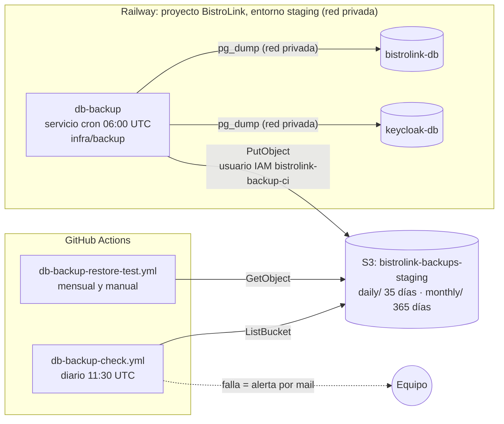

# Runbook: respaldo y restauración de bases de datos

> **Historia:** HU-029 (BL-183) · **Relacionado:** HU-030 (réplica en Cloudflare R2), BL-217 (contingencia Railway → Render) · **Documentación del proyecto:** Anexo 12, secciones 4, 5 y 6.
> **Última revisión:** 29/09/2026.

## 1. Qué se respalda y por qué

| Base (servicio de Railway) | Contenido                                                                                                                                               | ¿Se respalda? |
| -------------------------- | ------------------------------------------------------------------------------------------------------------------------------------------------------- | ------------- |
| `bistrolink-db`            | Datos de negocio multi-tenant (RLS): carta, mesas, pedidos, pagos, CFE                                                                                  | ✅            |
| `keycloak-db`              | Usuarios, credenciales y configuración de los realms. El realm se reimporta desde la imagen de `bistrolink-auth`, **los usuarios no**: solo existen acá | ✅            |
| MySQL de Kiwi TCMS         | Evidencia de pruebas, no datos de negocio                                                                                                               | ❌            |

**Objetivos:** RPO ≤ 24 h (un respaldo por día). RTO medido en cada verificación de restauración (sección 5).

## 2. Arquitectura



**Decisión: el respaldo corre dentro de Railway y no en GitHub Actions.** `keycloak-db` no tiene acceso público. Respaldarla desde GitHub habría obligado a exponerla a internet, y es la base más sensible (credenciales de todos los establecimientos). El servicio `db-backup` usa la red privada del proyecto, así que **ninguna base se expone para respaldarse**. GitHub conserva la parte de control, que no necesita tocar las bases: el chequeo de frescura y la verificación de restauración leen solo S3.

| Componente                    | Dónde                  | Frecuencia                                 | Credenciales                                                |
| ----------------------------- | ---------------------- | ------------------------------------------ | ----------------------------------------------------------- |
| `db-backup` (`infra/backup/`) | Railway, servicio cron | Diario, 06:00 UTC (03:00 Uruguay)          | Variables del servicio (usuario IAM `bistrolink-backup-ci`) |
| `db-backup-check.yml`         | GitHub Actions         | Diario, 11:30 UTC (08:30 Uruguay) y manual | Secrets `AWS_BACKUP_*`                                      |
| `db-backup-restore-test.yml`  | GitHub Actions         | Día 2 de cada mes, 12:00 UTC, y manual     | Secrets `AWS_BACKUP_*`                                      |

## 3. Estructura en S3

```
bistrolink-backups-<entorno>/
├── daily/<base>/<yyyy>/<mm>/<yyyy-mm-dd>.dump      ← todos los días; vence a los 35 días
├── daily/<base>/<yyyy>/<mm>/<yyyy-mm-dd>.sha256
├── monthly/<base>/<yyyy>/<yyyy-mm>.dump            ← el día 1 de cada mes; vence a los 365 días
└── monthly/<base>/<yyyy>/<yyyy-mm>.sha256
```

- `<base>` es `bistrolink-db` o `keycloak-db`.
- **Formato:** `pg_dump --format=custom --compress=9 --no-owner --no-acl`. Se restaura con `pg_restore` y no depende del usuario original.
- **Integridad:** checksum SHA-256 en el `.sha256`, en los metadatos del objeto (`x-amz-meta-sha256`) y validado por S3 al subir (`--checksum-algorithm SHA256`).
- Las reglas de ciclo de vida del bucket (`respaldos-diarios`, `respaldos-mensuales` y `limpieza`) dependen de estos prefijos. **No cambiar los prefijos sin cambiar las reglas.**

## 4. Configuración del servicio `db-backup` en Railway

Se hace una vez por entorno. Estos son los pasos para staging; para producción se repiten en el entorno `production` (con BL-220), cambiando `BACKUP_ENVIRONMENT` y `S3_BUCKET`.

### 4.1 Crear el servicio

1. Proyecto de Railway → entorno **staging** → **+ New** → **GitHub Repo** → repositorio `bistrolink`.
2. Renombrar el servicio a **`db-backup`**.
3. **Settings → Source:**
   - **Branch:** `develop`.
   - **Root Directory:** `/infra/backup`.
   - **Watch Paths:** `/infra/backup/**`, para que solo se reconstruya cuando cambie el servicio de respaldo.
4. **Settings → Build:** Builder **Dockerfile**. Railway lo detecta en la raíz configurada.
5. **Settings → Deploy:**
   - **Cron Schedule:** `0 6 * * *`. Railway interpreta el horario en UTC: son las 03:00 de Uruguay.
   - **Restart Policy:** **Never**. Un respaldo fallido no debe reintentarse en bucle; lo detecta el chequeo de frescura.
6. **Settings → Networking:** **no** generar dominio público ni TCP Proxy. El servicio no recibe tráfico.

### 4.2 Variables del servicio

| Variable                  | Valor                                | Notas                                                 |
| ------------------------- | ------------------------------------ | ----------------------------------------------------- |
| `BACKUP_ENVIRONMENT`      | `staging`                            | Solo para etiquetar y loguear                         |
| `S3_BUCKET`               | `bistrolink-backups-staging`         |                                                       |
| `AWS_REGION`              | `us-east-2`                          |                                                       |
| `AWS_ACCESS_KEY_ID`       | Access key de `bistrolink-backup-ci` | Marcar como **sealed** (oculta después de guardarla)  |
| `AWS_SECRET_ACCESS_KEY`   | Secret key de `bistrolink-backup-ci` | Marcar como **sealed**                                |
| `BISTROLINK_DATABASE_URL` | `${{bistrolink-db.DATABASE_URL}}`    | Variable de referencia: URL **interna** (red privada) |
| `KEYCLOAK_DATABASE_URL`   | `${{keycloak-db.DATABASE_URL}}`      | Variable de referencia: URL **interna** (red privada) |

- **No usar `DATABASE_PUBLIC_URL`:** el objetivo es no exponer las bases.
- El nombre entre `${{ }}` tiene que coincidir exactamente con el nombre del servicio de base de datos en Railway.

### 4.3 Primera ejecución

Un servicio cron de Railway se ejecuta en el horario programado, no al desplegarse. Para probarlo sin esperar a las 03:00:

1. Cambiar temporalmente el **Cron Schedule** a unos minutos después de la hora actual en UTC. Por ejemplo, si son las 20:10 UTC: `15 20 * * *`.
2. Esperar la ejecución y revisar los **logs** del servicio. Tiene que terminar con `respaldo diario completo: 2 de 2 bases`.
3. Verificar en S3 que existan los `.dump` y `.sha256` de hoy en `daily/bistrolink-db/` y `daily/keycloak-db/`.
4. **Volver a dejar el horario en `0 6 * * *`.**
5. Correr a mano **Respaldo — chequeo de frescura** en GitHub (_Actions → Run workflow_): tiene que dar ✅ para las dos bases.

## 5. Verificación de restauración

**Workflow:** _Actions → Respaldo — verificación de restauración → Run workflow_ (elegir entorno y, opcionalmente, una fecha). También corre solo el día 2 de cada mes.

Qué hace, sin tocar ninguna base real:

1. Baja el último dump de cada base, o el de la fecha elegida, y verifica el SHA-256.
2. Los restaura en un PostgreSQL 17 efímero dentro del runner de GitHub.
3. **`bistrolink-db`:** controla que haya migraciones de Prisma aplicadas y lista las filas por tabla.
4. **`keycloak-db`:** lista los realms con su cantidad de usuarios, exige que exista `bistrolink`, y arranca **Keycloak 26.7.2** (misma versión que `bistrolink-auth`) sobre la base restaurada hasta que publica la configuración OIDC del realm.
5. Informa el **RPO** (antigüedad del respaldo) y el **RTO** (tiempo total de descarga, restauración y verificación) en el resumen de la corrida y como artifact `informe-restauracion-…` (se conserva 90 días).

Después de cada verificación, registrar el resultado en la tabla del Anexo 12, sección 6.3.

**Alcance de la prueba de login:** el cliente `bistrolink-backend` es confidencial y su secreto no está en la base (se inyecta por Vault SPI, BL-185). Por eso esta verificación comprueba que Keycloak levanta el realm y sus usuarios desde la base restaurada. El login completo de un usuario se prueba en el simulacro de contingencia (BL-217), sobre un entorno con todos los servicios.

## 6. Restauración real (incidente)

> Procedimiento para recuperar una base de staging o producción. **Es destructivo sobre la base de destino:** requiere acuerdo del equipo y queda registrado en el Anexo 12 (sección 9).

1. **Elegir el respaldo:** normalmente el último `daily/`. Para volver más atrás de 35 días, el `monthly/` correspondiente.
2. **Descargarlo y verificarlo**, con credenciales que puedan leer el bucket:
   ```bash
   aws s3 cp s3://bistrolink-backups-staging/daily/bistrolink-db/2026/10/2026-10-05.dump .
   aws s3 cp s3://bistrolink-backups-staging/daily/bistrolink-db/2026/10/2026-10-05.sha256 .
   sha256sum 2026-10-05.dump   # comparar con el contenido del .sha256
   ```
3. **Detener la escritura:** poner en pausa los servicios que usan esa base (`bistrolink-api` para `bistrolink-db`, `bistrolink-auth` para `keycloak-db`).
4. **Restaurar sobre una base vacía.** Opción recomendada: crear un servicio PostgreSQL nuevo en Railway, restaurar ahí y apuntar el servicio a la nueva URL. Así la base dañada queda intacta hasta confirmar que la restauración funciona.
   ```bash
   pg_restore --no-owner --no-acl --exit-on-error --dbname="$URL_DESTINO" 2026-10-05.dump
   ```
   Para ejecutarlo sin exponer la base destino se puede usar el túnel de Railway: `railway connect <servicio>`.
5. **Verificar:** `/health/ready` de la API, login en staging y carga del menú de un tenant.
6. **Reanudar** los servicios y **registrar** en el Anexo 12: fecha, respaldo usado, RPO y RTO reales, causa y responsables.

## 7. Qué hacer si algo falla

| Síntoma                                      | Dónde se ve                      | Acción                                                                                                                                      |
| -------------------------------------------- | -------------------------------- | ------------------------------------------------------------------------------------------------------------------------------------------- |
| Falla **Respaldo — chequeo de frescura**     | Mail de GitHub y pestaña Actions | Revisar los logs del servicio `db-backup` en Railway del día. Corregir y ejecutar a mano (sección 4.3)                                      |
| Log con `falta la variable de entorno …`     | Logs de `db-backup`              | Revisar las variables de la sección 4.2                                                                                                     |
| Log con `no respondió después de 6 intentos` | Logs de `db-backup`              | Confirmar que las bases estén activas y que las variables de referencia apunten al nombre correcto del servicio                             |
| `pg_dump: error: … server version mismatch`  | Logs de `db-backup`              | Railway actualizó PostgreSQL a una versión mayor: subir `PG_MAJOR` en `infra/backup/Dockerfile` y en `db-backup-restore-test.yml`           |
| `AccessDenied` al subir a S3                 | Logs de `db-backup`              | Credenciales rotadas o política IAM modificada: revisar `bistrolink-backup-ci` (Anexo 12, sección 5.1)                                      |
| Falla **verificación de restauración**       | Pestaña Actions                  | **Incidente de severidad alta:** existe un respaldo que no se puede usar. Revisar el informe, corregir y volver a verificar antes de cerrar |

## 8. Seguridad

- **Las bases no se exponen:** el respaldo usa la red privada de Railway.
- **Mínimo privilegio:** el usuario IAM `bistrolink-backup-ci` puede subir, leer y listar solo en los buckets de respaldo, y **no puede borrar**. Si su clave se filtra, no se pueden destruir los respaldos existentes; además el versionado conserva las versiones anteriores.
- **Secretos:** las credenciales viven en variables _sealed_ de Railway y en secrets de GitHub. El script nunca imprime las URLs de conexión.
- **Cifrado:** en tránsito (HTTPS a S3) y en reposo (SSE-S3). Los buckets bloquean el acceso público.
- **Mejora futura:** reemplazar las access keys permanentes por credenciales temporales (OIDC de GitHub a un rol de IAM).
