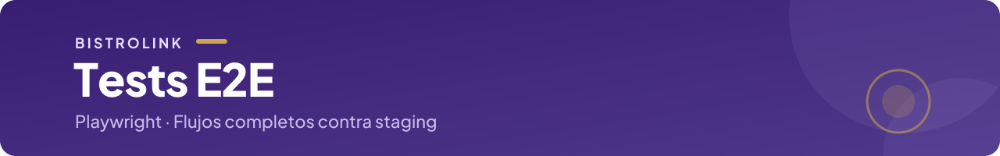

<p align="center">
  
</p>

<p align="center">
  <a href="../README.md">← BistroLink</a> ·
  
  
</p>

## Guía de uso

Esta carpeta contiene los tests end-to-end de BistroLink. Leela entera antes de crear o correr tests nuevos: varias reglas existen para evitar fallos que solo aparecen en CI.

## 🚨 Reglas de oro

1. 📁 Un spec pertenece a un dominio: `e2e/<dominio>/<feature>.spec.ts`.
2. 🚫 Nunca hardcodear URLs. Usar `page.goto('/ruta')` (toma `BASE_URL`) y `process.env.API_URL` para la API.
3. 🌐 Local sirve para escribir y depurar. El CI corre siempre contra **staging**.
4. ⏸️ La regresión visual está **desactivada hasta el sprint 8** (el `test.describe` de screenshots está comentado en `menu-publico.spec.ts`). Cuando se reactive, los baselines se regeneran **solo** con `npm run test:e2e:update-snapshots` (Docker). Nunca commitear `*-darwin.png` ni `*-win32.png`.
5. ⚠️ Un spec visual nuevo antes del sprint 8 debería correr con `--ignore-snapshots` en tu máquina (así no falla por falta de baseline), y quedar comentado como `menu-publico.spec.ts` hasta esa fecha.
6. 🚫 Nada de `waitForTimeout`. Usar aserciones que esperan solas.
7. 🎯 Prioridad por sprint: la regresión visual corresponde a los **sprints 8 y 9** y hoy está desactivada. Antes de eso, el foco está en tests **funcionales**.

## Estructura

```
e2e/
├── comensal/
│   ├── menu.spec.ts                      # HU-001: menú vía QR
│   ├── menu-publico.spec.ts              # HU-002: menú vía URL directa
│   ├── menu-publico.spec.ts-snapshots/   # baselines *-linux.png (comentado hasta sprint 8)
│   ├── pedidos.spec.ts                   # HU-003: carrito y confirmación de pedido
│   └── llamado-mozo.spec.ts              # BL-69: llamado al mozo (usa support/auth.ts)
├── kds/
│   └── observaciones-kds.spec.ts         # observaciones del comensal en el KDS
├── pedido-listo-entregado.spec.ts        # flujo listo → entregado (pendiente de mover a su dominio)
├── support/                              # fixtures e IDs del seed; sin tests propios
│   ├── ids.ts                            # UUIDs y paths del seed
│   └── auth.ts                           # fixtures kdsPageMozo / kdsPageAdmin
└── README.md
playwright.config.ts                      # raíz del monorepo
scripts/e2e-update-snapshots.sh           # regenera baselines en Docker
```

Reglas de estructura:

- **Carpeta por dominio** (`comensal`, `kds`, ...): el actor o la pantalla del producto, no el ticket. El ticket (`HU-00X`) va en el `test.describe`.
- **Nombre del archivo** en kebab-case y descriptivo: `menu-publico.spec.ts`.
- ⚠️ **Nombres de spec únicos en todo el repo.** Los `testMatch` de `playwright.config.ts` son regex sin anclar al path: un `menu-publico.spec.ts` en otra carpeta también matchearía.
- **`support/` no lleva `.spec.ts`.** Playwright solo ejecuta `*.spec.ts` / `*.test.ts`, así que lo que vive ahí (fixtures, IDs del seed) se importa pero no se corre.
- **IDs y datos del seed** siempre en `support/`, nunca dentro de los specs.
- **Tests independientes entre sí.** `fullyParallel: true` los corre en paralelo y sin orden garantizado.

## Crear un test nuevo

1. Elegí (o creá) la carpeta del dominio en `e2e/`.
2. Creá `<feature>.spec.ts`.
3. Importá los IDs del seed desde `e2e/support/ids.ts`. Si falta uno, agregalo ahí (y al seed).
4. Decidí en qué navegadores tiene que correr (ver tabla). Por defecto solo corre en `chromium`.
5. Corrélo local con `--project=chromium --ignore-snapshots`.
6. Abrí el PR.

### Proyectos configurados

| Proyecto         | Dispositivo    | Qué specs corre             |
| ---------------- | -------------- | --------------------------- |
| `chromium`       | Desktop Chrome | Todos                       |
| `mobile-chrome`  | Pixel 5        | Solo `menu-publico.spec.ts` |
| `mobile-safari`  | iPhone 12      | Solo `menu-publico.spec.ts` |
| `desktop-safari` | Desktop Safari | Solo `menu-publico.spec.ts` |

Si tu spec también debe correr en mobile/Safari, agregalo al `testMatch` de esos proyectos en `playwright.config.ts`.

### `e2e/support/`

| Archivo   | Qué exporta                                                                                                                                                               | Para qué                                                                                                                                                           |
| --------- | ------------------------------------------------------------------------------------------------------------------------------------------------------------------------- | ------------------------------------------------------------------------------------------------------------------------------------------------------------------ |
| `ids.ts`  | `TENANT_ID`, `RESTAURANTE_ID`, `MESA_ID`, `MESA_ID_RATE_LIMIT`, `ITEM_DISPONIBLE`, `ITEM_NO_DISPONIBLE`, `MESA_PATH`, `MESA_PATH_RATE_LIMIT`, `MENU_URL_PATH`, `KDS_PATH` | UUIDs y paths fijos que carga `apps/backend/prisma/seed.ts`. Si el seed cambia un UUID o un nombre de ítem, se actualiza acá una sola vez.                         |
| `auth.ts` | `test`/`expect` (extiende los de `@playwright/test`), fixtures `kdsPageMozo` y `kdsPageAdmin`                                                                             | Loguea contra Keycloak en una pestaña nueva del `context` y la deja en `/kds` ya autenticada. Usalo en vez de escribir el login a mano en cada spec de `e2e/kds/`. |

`MESA_ID_RATE_LIMIT` existe porque `MESA_ID` ya lo usan varios specs para leer/agregar al carrito: si un test de rate-limit (que agota el cupo de 1 llamado/minuto) compartiera esa misma mesa, podría hacer fallar a otro test que corre en paralelo. Si tu test agota un cupo o deja la mesa en un estado particular, seguí ese patrón: agregá tu propia mesa a `ids.ts` en vez de reusar `MESA_ID`.

Para usar `kdsPageMozo`/`kdsPageAdmin` localmente necesitás las credenciales de los usuarios de prueba de **tu Keycloak local** en variables de entorno de la sesión (`TEST_MOZO_USERNAME`, `TEST_MOZO_PASSWORD`, `TEST_ADMIN_USERNAME`, `TEST_ADMIN_PASSWORD`). Los valores son los de tu `apps/backend/.env`. Nunca se escriben en un spec, en un README ni en un commit, y las de staging no se usan en local.

```powershell
# PowerShell: la contraseña se pide sin mostrarla
$env:TEST_MOZO_USERNAME = "<usuario local>"
$env:TEST_MOZO_PASSWORD = [System.Net.NetworkCredential]::new('', (Read-Host "TEST_MOZO_PASSWORD" -AsSecureString)).Password
npx playwright test e2e/comensal/llamado-mozo.spec.ts --project=chromium --ignore-snapshots
```

### Plantilla

```ts
import { test, expect } from "@playwright/test";
import { MESA_PATH } from "../support/ids";

test.describe("HU-00X · Título corto de la historia", () => {
  test("el comensal ve el menú al entrar por QR", async ({ page }) => {
    await page.goto(MESA_PATH); // usa BASE_URL de la config

    await expect(page.getByRole("heading", { name: "Menú" })).toBeVisible();
  });
});
```

Si tu spec necesita loguearse en `/kds` (mozo o admin), importá `test`/`expect` desde `../support/auth` en vez de `@playwright/test` — ver `e2e/kds/llamado-mozo.spec.ts` como ejemplo.

### Buenas prácticas

- **Locators por rol, label o testid:** `getByRole`, `getByLabel`, `getByTestId`. Evitar selectores CSS/XPath atados a la estructura.
- **Aserciones web-first:** `await expect(locator).toBeVisible()` / `toHaveText(...)`. No usar `expect(await locator.isVisible()).toBe(true)`, porque no reintenta.
- 🚫 **Sin sleeps:** ni `waitForTimeout` ni `setTimeout`. Si hace falta esperar algo, se espera a una condición visible.
- **Sin estado compartido:** un test no puede depender de datos que crea otro.
- ⚠️ **Cuidado con staging:** el CI corre contra datos compartidos. Los tests deben ser de lectura, o limpiar lo que crean. Hoy esto NO se cumple del todo: los specs que confirman pedidos los crean de verdad contra la API, y cada corrida deja pedidos acumulados en el KDS del tenant de testing. La limpieza automática está en BL-285.
- **Accesibilidad:** `@axe-core/playwright` ya está en `devDependencies` (`new AxeBuilder({ page }).analyze()`).

## Correr en local

### Una sola vez

```bash
npm ci
npx playwright install              # macOS / Windows
npx playwright install --with-deps  # Linux
```

### Levantar el entorno

⚠️ Los tests **no** levantan servidores. Antes de correrlos necesitás backend y frontend locales con los datos del seed cargados (los mismos IDs que usa `e2e/support/`):

```bash
npm run dev   # levanta backend (start:dev) y frontend (dev)

# Cargar el seed — el script está en apps/backend/prisma/seed.ts, y define
# los IDs que usa e2e/support/ids.ts:
cd apps/backend
npx prisma db seed
```

`apps/backend/package.json` declara `"prisma": { "seed": "ts-node prisma/seed.ts" }`, así que `npx prisma db seed` corre `apps/backend/prisma/seed.ts` directo — no hace falta un script npm aparte. Necesita `DATABASE_URL` apuntando a tu Postgres local (la misma que usa `start:dev`).

**Seed en staging:** la base de staging no tiene acceso público. Para correr el seed contra staging se sigue el procedimiento de [`docs/runbooks/migraciones-y-seed.md`](../docs/runbooks/migraciones-y-seed.md) (sección 5).

**Verificar que cargó bien:** con el backend levantado (`start:dev`), pedile directamente los IDs de `e2e/support/ids.ts` a la API — es la misma llamada que hacen los specs en `obtenerMenu()`:

```bash
curl http://localhost:3001/menu/tenant/11111111-1111-1111-1111-111111111111/restaurante/22222222-2222-2222-2222-222222222222
```

Si devuelve el JSON del menú (con categorías e ítems, incluyendo `Milanesa a la napolitana` y `Agua con gas`), el seed está cargado y los tests deberían poder correr. Si da 404 o un array vacío, el seed no corrió o corrió contra otra base (revisá `DATABASE_URL`).

Alternativa visual: `npx prisma studio` (desde `apps/backend`) abre una UI en el browser para navegar las tablas y confirmar a ojo que `Tenant`, `Restaurante`, `Mesa` e `Item` tienen las filas esperadas.

El seed es idempotente (`upsert` por id): se puede volver a correr sin resetear la base.

### Variables de entorno

| Variable   | Valor local             | Para qué                                      |
| ---------- | ----------------------- | --------------------------------------------- |
| `BASE_URL` | `http://localhost:3000` | Frontend (es el default de la config)         |
| `API_URL`  | `http://localhost:3001` | API. Los specs deben leerla de acá            |
| `CI`       | (no setear)             | En CI activa 2 retries y el reporter `github` |

En PowerShell: `$env:API_URL="http://localhost:3001"; npx playwright test ...`

### Comandos

```bash
# Lo más común: todo, solo Chromium, sin comparar screenshots
API_URL=http://localhost:3001 npx playwright test --project=chromium --ignore-snapshots

# Equivalente vía npm
npm run test:e2e -- --project=chromium --ignore-snapshots

# Un spec / un test por nombre
npx playwright test e2e/comensal/menu-publico.spec.ts --project=chromium --ignore-snapshots
npx playwright test -g "URL directa" --project=chromium --ignore-snapshots

# Depurar
npx playwright test --ui
npx playwright test --headed
npx playwright test --debug

# Reporte HTML y trazas de la última corrida
npx playwright show-report
npx playwright show-trace <ruta/al/trace.zip>
```

Los proyectos `mobile-safari` y `desktop-safari` usan WebKit. Si los querés correr en tu máquina, instalalo con `npx playwright install webkit`.

### Reproducir lo que hace el CI (contra staging)

```bash
BASE_URL=<URL de la web de staging> \
API_URL=<URL de la API de staging> \
npx playwright test --ignore-snapshots
```

Las URL son las que usa el job de Playwright en `ci.yml`. Los usuarios de prueba de staging solo los tiene el pipeline: en local se prueba contra staging sin login, o con el Keycloak local.

### Local vs CI

|             | Local                 | CI                                                                 |
| ----------- | --------------------- | ------------------------------------------------------------------ |
| Target      | `localhost`           | Staging ya desplegado                                              |
| Servidores  | Los levantás vos      | No se levantan                                                     |
| Datos       | Seed local            | Datos de staging                                                   |
| Screenshots | Comentados en el spec | Comentados hasta reactivar; luego se comparan contra `*-linux.png` |
| Retries     | 0                     | 2                                                                  |
| Reporter    | `list`                | `github`                                                           |

## Regresión visual (baselines)

> ⏸️ **Desactivada por ahora.** La regresión visual corresponde a los **sprints 8 y 9**; hasta entonces el foco está en los tests **funcionales** (flujos, datos y comportamiento) y no se escriben tests visuales nuevos. El `test.describe('Regresión visual...')` de `e2e/comensal/menu-publico.spec.ts` está comentado, con una nota (`COMENTADA A PROPÓSITO`) que explica por qué y cómo reactivarlo.
>
> 🎯 **Para reactivarla (sprint 8):** en `menu-publico.spec.ts`, descomentar ese bloque y restaurar el import de `MESA_PATH` y la const `MENU_QR_PATH` (la nota dentro del archivo dice exactamente dónde), y regenerar los baselines con `npm run test:e2e:update-snapshots`. Lo que sigue en esta sección aplica desde ese momento.

Playwright incluye la plataforma en el nombre del baseline (`menu-qr-chromium-darwin.png` vs `menu-qr-chromium-linux.png`) y el CI corre en Linux. Un baseline generado en macOS o Windows nunca va a matchear ahí por diferencias de fuentes y antialiasing, aunque no haya ningún bug.

🚨 **Regla: los baselines se generan solo dentro del contenedor de Docker.**

```bash
npm run test:e2e:update-snapshots
```

- Requiere Docker. Corre `scripts/e2e-update-snapshots.sh`.
- ⚠️ Por defecto apunta a **staging**, porque el CI compara contra staging: el baseline tiene que salir de los mismos datos que va a ver el CI. Si lo generás contra un local con un seed distinto, el CI va a fallar.
- Para apuntar a un backend local, pasá `BASE_URL` y `API_URL` (solo funciona bien en Linux/WSL2, por `--network host`).
- Cada screenshot genera **un archivo por proyecto** (`-chromium-linux.png`, `-mobile-chrome-linux.png`, `-mobile-safari-linux.png`, `-desktop-safari-linux.png`).
- Hoy el script regenera **solo** `e2e/comensal/menu-publico.spec.ts`. Si sumás otro spec visual, extendé el script.

Después de regenerar:

```bash
git status e2e/comensal/menu-publico.spec.ts-snapshots/
```

Abrí las imágenes que cambiaron y commiteá solo si el cambio es intencional, en el mismo PR que el cambio de UI que lo causa.

⚠️ **Versión de la imagen:** `PLAYWRIGHT_IMAGE` en el script tiene que coincidir con la versión de `@playwright/test`. Verificá con `npx playwright --version`. Si Playwright dice `Please update docker image as well`, actualizá el tag del script (o fijá `@playwright/test` a una versión exacta en `package.json`).

### Escribir tests visuales estables

```ts
await expect(page).toHaveScreenshot("menu-qr.png", {
  animations: "disabled",
  // Enmascarar todo lo que cambia entre corridas (ejemplo de selector):
  mask: [page.getByTestId("app-version-badge")],
});
```

Enmascarar o evitar: fechas y horas, contadores, imágenes remotas y el badge de versión (en staging muestra el SHA del deploy y cambia en cada release). No subir los umbrales de tolerancia para tapar diferencias reales.

## Errores comunes

| Síntoma                                                         | Causa                                                                                                                                                                          | Solución                                                                                                                     |
| --------------------------------------------------------------- | ------------------------------------------------------------------------------------------------------------------------------------------------------------------------------ | ---------------------------------------------------------------------------------------------------------------------------- |
| `A snapshot doesn't exist at ...-darwin.png, writing actual`    | Corriste un spec visual fuera de Docker                                                                                                                                        | Correr con `--ignore-snapshots`; borrar el archivo generado. 🚫 **No commitearlo**                                           |
| El spec visual pasa en tu máquina y falla en CI                 | Baseline generado fuera de Docker, o contra datos distintos a staging                                                                                                          | Regenerar con `npm run test:e2e:update-snapshots`                                                                            |
| `Please update docker image as well`                            | `PLAYWRIGHT_IMAGE` desincronizada de `@playwright/test`                                                                                                                        | `npx playwright --version` y actualizar el tag                                                                               |
| `unable to upgrade to tcp, received 404` (Git Bash)             | Conversión de paths de MSYS                                                                                                                                                    | El script ya setea `MSYS_NO_PATHCONV=1`; usarlo en vez de `docker run` a mano                                                |
| Contra `localhost` desde Docker no conecta (macOS/Windows)      | `--network host` solo funciona bien en Linux                                                                                                                                   | Usar WSL2, o apuntar a staging                                                                                               |
| `Executable doesn't exist ...`                                  | Faltan los navegadores                                                                                                                                                         | `npx playwright install` (o `install webkit`)                                                                                |
| Falla en local por datos que faltan                             | Seed no cargado                                                                                                                                                                | Cargar el seed antes de correr                                                                                               |
| Mi spec nuevo no corre en mobile/Safari                         | Esos proyectos tienen `testMatch` acotado                                                                                                                                      | Sumarlo al `testMatch` en `playwright.config.ts`                                                                             |
| Corre un spec de otro dominio sin querer                        | Nombre de archivo duplicado que matchea el regex                                                                                                                               | Nombres de spec únicos en todo el repo                                                                                       |
| Falla intermitente                                              | `waitForTimeout` o dependencia entre tests                                                                                                                                     | Aserciones web-first; tests independientes                                                                                   |
| Los snapshots quedan con dueño `root` (Linux)                   | Bind mount de Docker                                                                                                                                                           | `sudo chown -R $USER e2e/`                                                                                                   |
| Se rompe el visual en cada deploy                               | El badge de versión (SHA) entra en el screenshot                                                                                                                               | Enmascararlo con `mask`                                                                                                      |
| `llamado-mozo.spec.ts` (rate limit) falla en el reintento de CI | El job tiene `retries: 2`; un reintento a menos de 1 minuto del anterior encuentra la mesa ya throttled, así que el PRIMER click del reintento ya cae en "Ya llamaste al mozo" | Considerar `retries: 0` para este spec puntual (`test.describe.configure({ retries: 0 })`) o usar una mesa nueva por corrida |

⚠️ No confundir con `test:e2e` del backend: `npm run test:e2e` en la raíz corre **Playwright**. Los tests de aislamiento multi-tenant del backend (`*.e2e-spec.ts`, Jest) son otra cosa y se corren desde su workspace.

## Checklist antes de abrir el PR

- [ ] El spec está en `e2e/<dominio>/` y su nombre es único.
- [ ] No hay URLs, IDs ni credenciales hardcodeados.
- [ ] Sin `waitForTimeout`; los locators son por rol/label/testid.
- [ ] Pasa local con `--project=chromium --ignore-snapshots`.
- [ ] (Sprints 8 y 9) Si toca UI con screenshots: baselines regenerados con `npm run test:e2e:update-snapshots` y diff revisado.
- [ ] No hay `*-darwin.png` ni `*-win32.png` en el commit.
- [ ] Si debe correr en mobile/Safari: agregado al `testMatch`.
